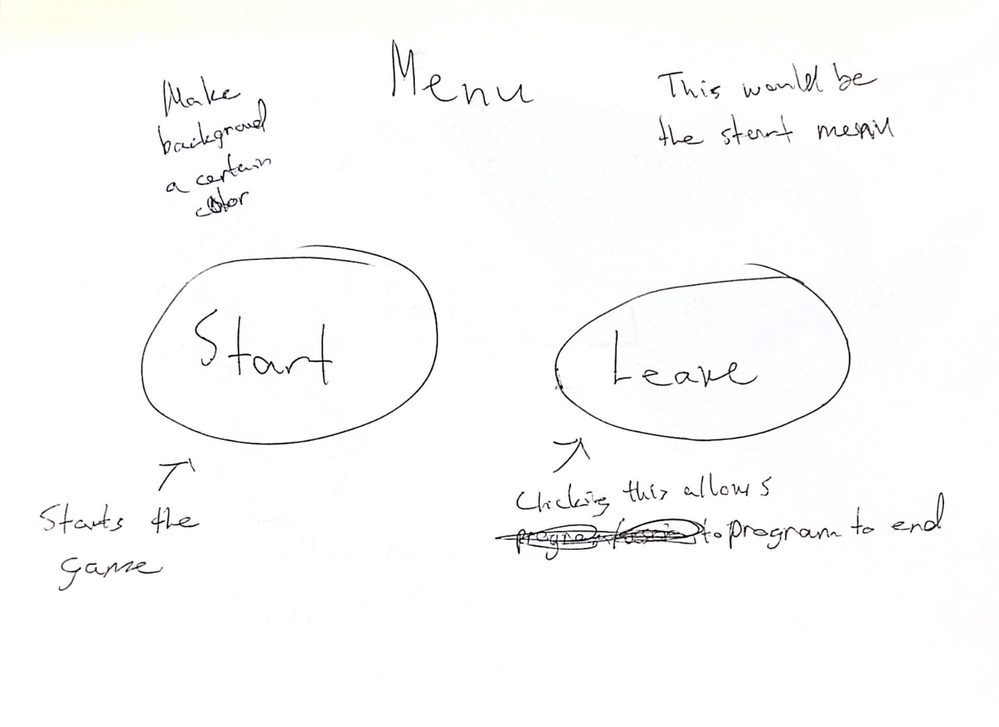
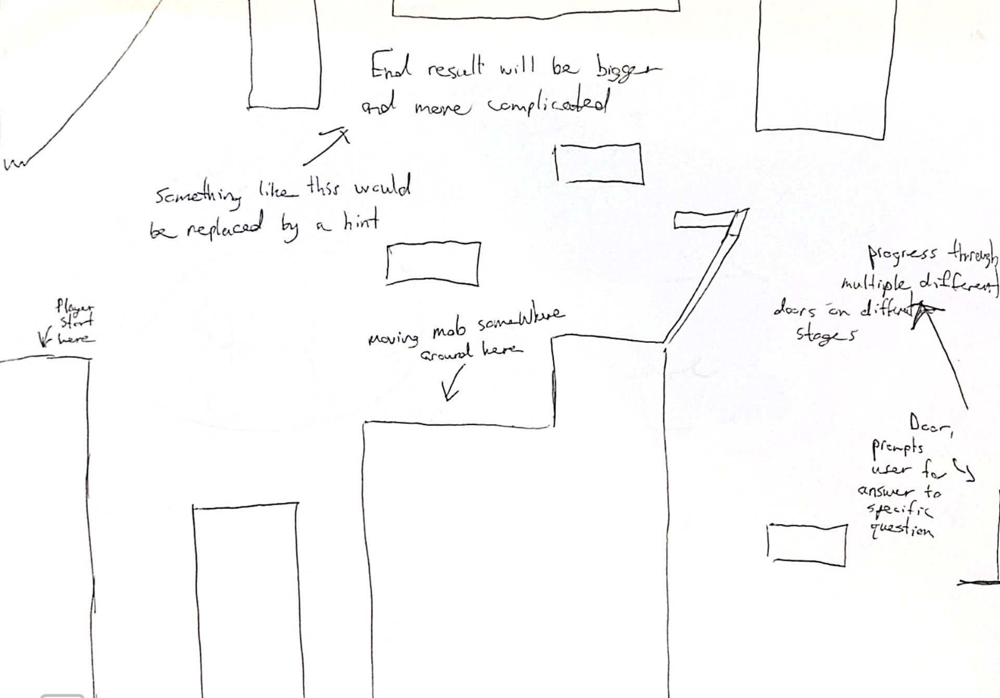
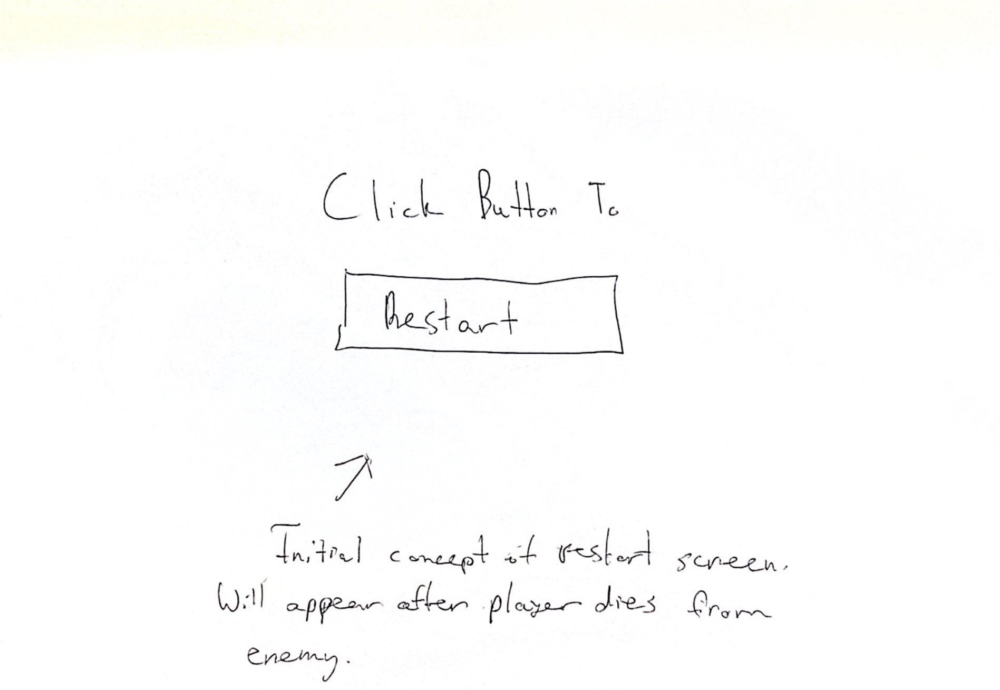
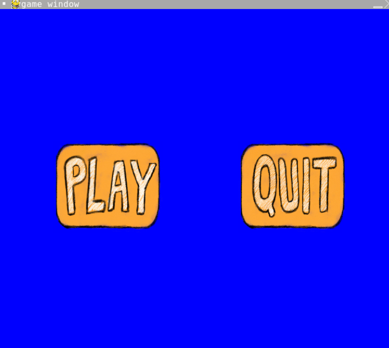
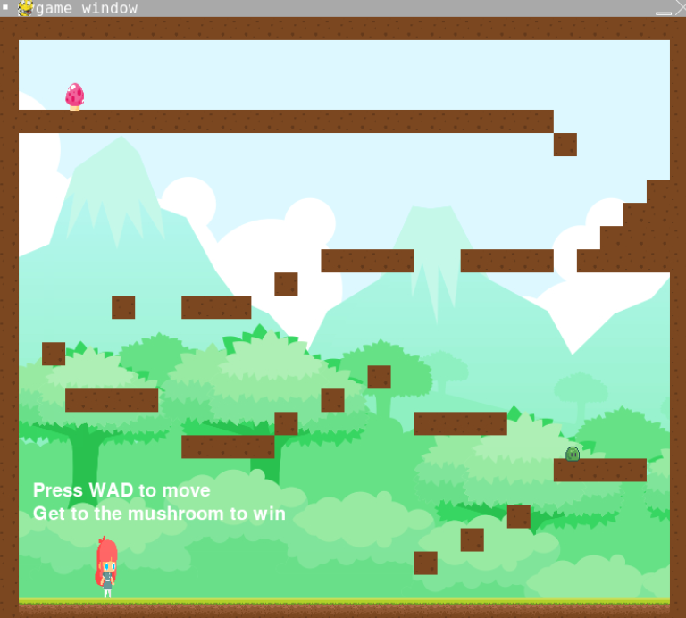
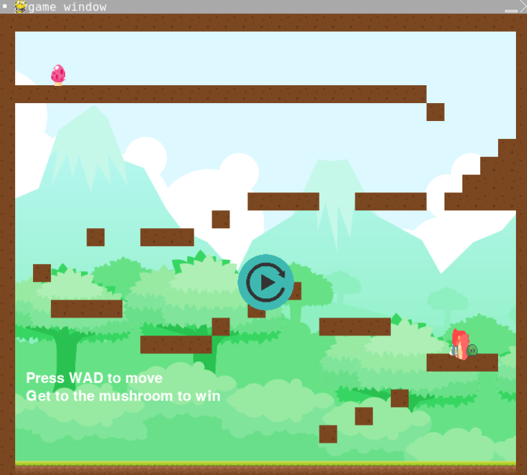
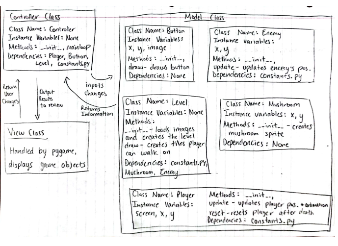

# CS110 Project Proposal
# Curious Climb
## CS 110 Final Project
###  Fall, 2022 
### [Assignment Description](https://docs.google.com/document/d/1H4R6yLL7som1lglyXWZ04RvTp_RvRFCCBn6sqv-82ps/edit?usp=sharing)

https://replit.com/join/cvruezeqem-johnnylu1

### Team: 25
####  Johnny Lu and Emily Mendez

***

## Project Description
The user will have to climb up towards the top and reach the mushroom to win. There will be slimes along the way that kills the player upon contact. player can restart if they happen to hit the slime. If the player reaches the mushroom, the player will be teleported back to the beginning. If the player reaches the mushroom again, the player officially wins and the game ends, hence the name "Curious Climb" because the player needs to be curious as to why they were teleported back to the beginning and go towards the mushroom again to truly win. 

***    

## User Interface Design

- **Initial Concept**
 *  
 * This is the first screen that the user sees. They are given the two choices: start or leave. Start will allow the game to begin while leave will close out of the game. 
 * 
 * This is the screen where the actual game takes place. Pressing W will allow the player to jump. Pressing A and D will let the player move left and right, respectively. The goal of the player is to reach the end and touch the mushroom. However, the first time touching the mushroom will send the player back to its original position. It is only after the second encounter with the mushroom that the game ends and the player wins. 
 * 
 * This is the screen the user will see after touching the enemy slime. The user will be prompted with an option to restart the game.
- **Final GUI**
 *  
 * 
 *  
***        

## Program Design

* Non-Standard libraries
1. Pygame
[https://www.pygame.org/docs/]
(Python module used for writing games)

* Class Interface Design
        *  
* Classes
1. player:
Class that initializes the player. The player will be able to able or move left and right. This player is able to controlled by the user using keyboard inputs WAD. Methods of this class includes init, update, and reset. Init intializes the player. Update is responsible for the player movement as well as collision mechanics. Reset will return player to its original position. 

2. level: The Level class determines how the each object is placed (dirt tile, grass tile, enemmy, and mushroom). The Level class takes data from a list that establishes this placement. This creates the overall layout of the game and the tiles in which the player must utilize to reach the top. Methods of this class includes init and draw. Init initializes the Level that will eventually take input from the tile placement data. Draw places objects onto certain square areas of the screen depending on what is defined in the tile placement data. 

3. enemy: This class is responsible for creating the object that ends the game upon contact with the player. This will prompt the restart button to appear. Methods of this class include init and draw. Init initializes the Enemy and allows for it to be created in certain areas through interaction with the Level class. Draw creates the constant movement of the enemy through constant updates. 

4. mushroom: This class creates the object that is the ultimate end goal of the player. The player must climb to the top and interact with it. The first time interacting with it brings the player back to its original position while the second time interacting with it ends the game. This class has an init method that initializes the mushroom and allows it to be placed depending on what is defined in the tile placement data. 

5. button: This class is responsible for creating the buttons that the player will click. Through input, the class creates the start, quit, and restart button. Methods of this class includes init and draw. Init initializes the button and allows for it to be displayed onto the screen depending on the game state. Draw creates the button and checks to see if mouse is hovering and clicking on othe button.

7. my_controller: A class that defines the rules and logic of the program and how it operates. It calls each class and loads their elements into the game constantly. The view is updated through Controller input. Controller handles the relationship between all the classes and allows them to function together. Methods include init and mainloop. Init initializes the controller and makes it so that the view is changed. Mainloop deals with the main functioning of the game, such as updating and checking for changes. 

## Project Structure and File List

The Project is broken down into the following file structure:

* main.py
* src
    * constants.py, enemy.py, level.py, mushroom.py, my_controller.py, player.py, button.py
* assets
    * BG.png, dead.png, dirttile.png, girl1.png, girl2.png, girl3.png, girl4.png, girl5.png, girl6.png, girl7.png, girl8.png, girl9.png, girl10.png, girl11.png, girl12.png, girl13.png, girl14.png, girl15.png, girl16.png, girl17.png, girl18.png, girl19.png, girl20.png, grasstile.png, mushroom1.png, play.png, quit.png, restart.png, slime.ping, final_game.png, final_gameover.png, final_startmenu.png, initial_game.jpg, initial_gameover.jpg, initial_startmenu.jpg

***

## Tasks and Responsibilities 

Software Lead - Johnny. Helped organize the code for the main game into the proper MCV format, which allowed all portions of the code to be run from a single file. Thought out the main concept of the game. Found all the image files that are utilized in the game. 

Front End Specialist - Johnny. Conducted a lot of research with pygame. Used classes to make various features of the game including certain visual aspects such as the buttons and text. Built the layout of the game in which the player must traverse through. The locations of the mushroom and the enemies were determined by Johnny. Created movement for the enemies as well as sprite animations for the player. 

Back End Specialist - Johnny. Made all of the major classes that are used in the main game. Made sure all the classes functioned properly and was able to use each individual class to build on another class which ultimately came together in the end. Implemented the classes into the Controller file and allowed the game to run without any problems.

Emily - Helped put images into the README as well as creating the class diagram. 
## Testing
After writing a couple lines of code, the program would always be run to make sure there were no problems causing the game to break. This method was repeated until the very end of the creation process. If a counter was being used, print statements would be utilized to make sure the counter is properly implemented. 

## ATP

| Step                 |Procedure             |Expected Results                   |
|----------------------|:--------------------:|----------------------------------:|
|  1                   | Open terminal, navigate to folder, and type python3 main.py  | Start menu is displayed  |
|  2                   | Select Start or Quit   | If Start is selected, the game will begin and  load. If Quit is selected, the program will end   |
|  3        |    Click WAD      |    If W is clicked, the player will move left. If D is clicked, the player will move right. If W is clicked, the player will jump         |
|  4          | Using WAD, go towards mushroom at the top and avoid the slime      |         If contact with slime is made, the player will die and will be given the option to restart         | 
|  5       |  Touch the mushroom       |Upon first contact with mushroom, the player will be teleported back to the beginning |
|6 |Touch the mushroom one more time | Upon second contact with mushroom, the game will end and the player wins
